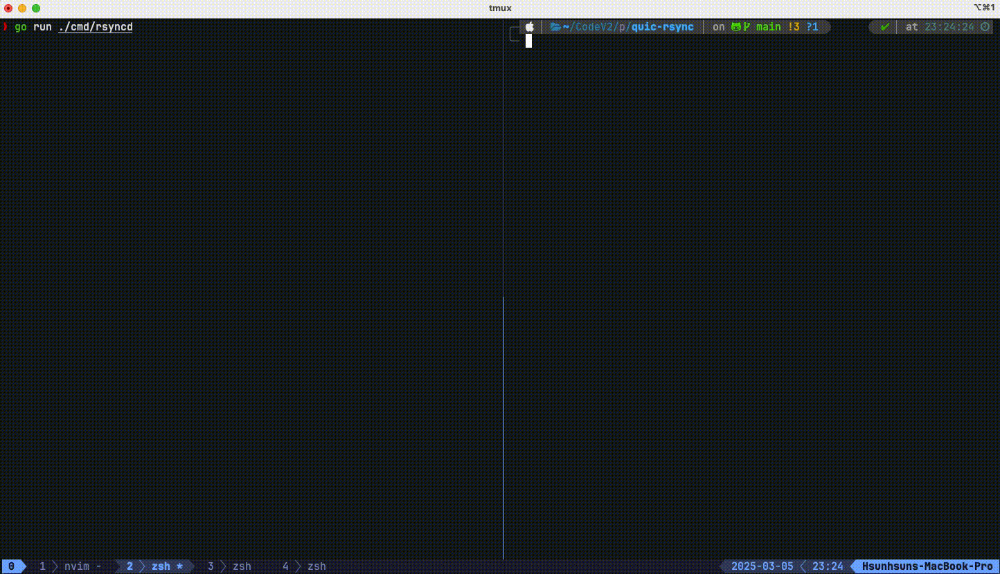
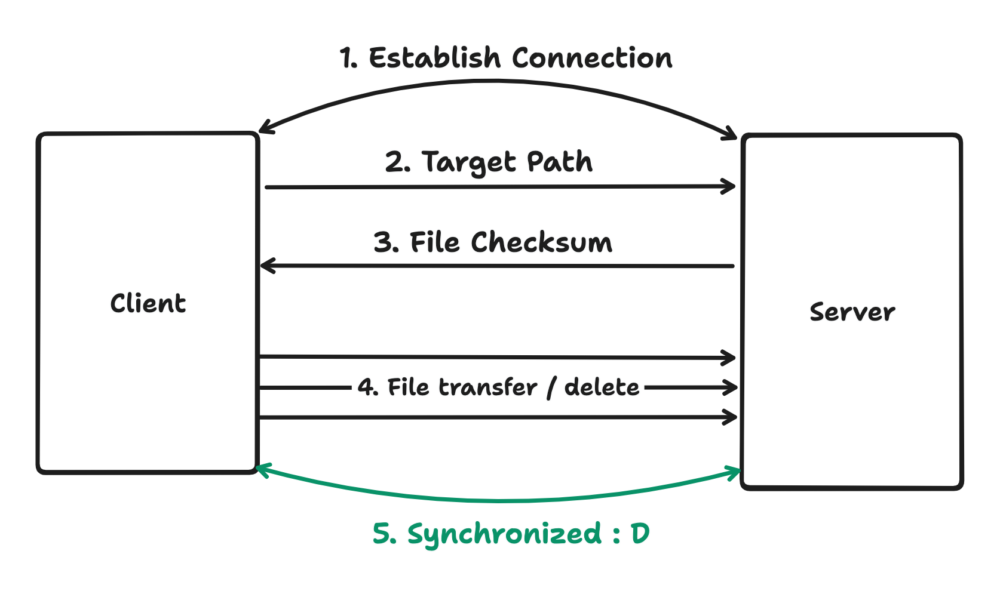

# quic-rsync

## Quick Demo



## Features

- [x] Transfer files across the Internet over QUIC
- [x] Transfer multiple files (support directory)
- [x] Transfer only the changed files
- [x] Delete files in the destination if it is not in the source

## Quick start

```bash
git clone git@github.com:BaBa0525/quic-rsync.git
cd quic-rsync
go mod download

# Run the deamon in the target host
go run ./cmd/rsyncd

# Copy source files to the destination
go run ./cmd/rsync /path/to/source host:port@/path/to/destination
```

## Under the hood



1. Client send initial packet to the deamon and deamon sends back the file info in the destination.

   ```go
   type FileInfo struct {
       Path     string `json:"path"`
       CheckSum string `json:"checksum"`
   }

   type FileInfoPacket struct {
       Header Header
       Files  []FileInfo
   }
   ```

2. Client calculates the checksum of the source file and compares it with the destination file.

3. If the checksums are different, client sends the file to the deamon.

4. Deamon writes/removes the file to the destination.

5. Repeat the process for all the files in the source directory.

## Slides (For my final project :D)

[Slides](https://www.canva.com/design/DAFlorTVR0U/EqRAEtoupxw5DsNhEJUd0A/edit?utm_content=DAFlorTVR0U&utm_campaign=designshare&utm_medium=link2&utm_source=sharebutton)
